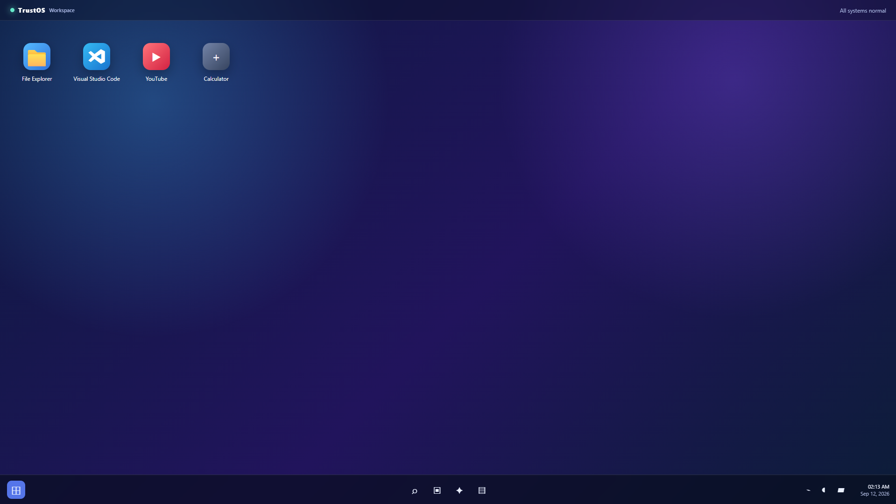
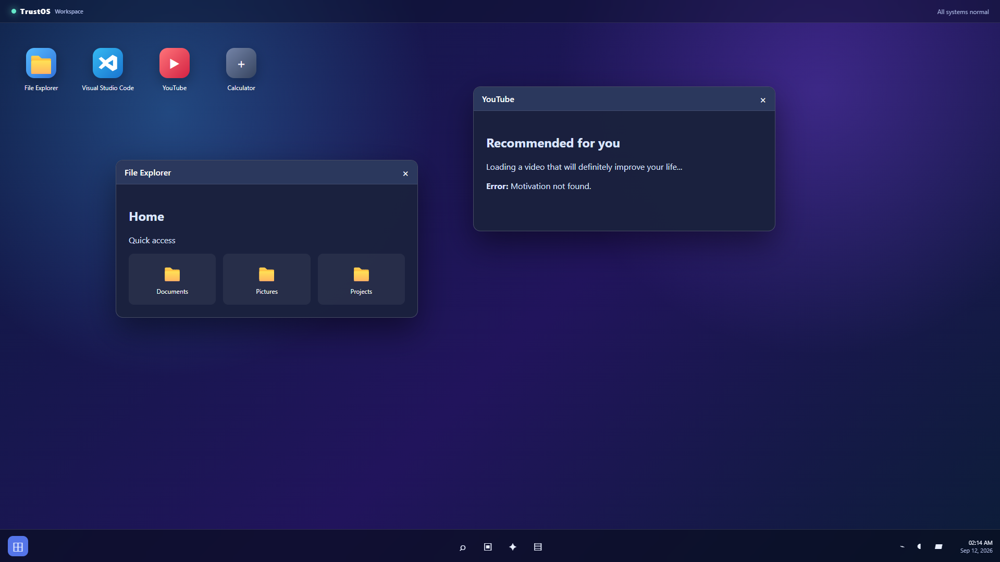
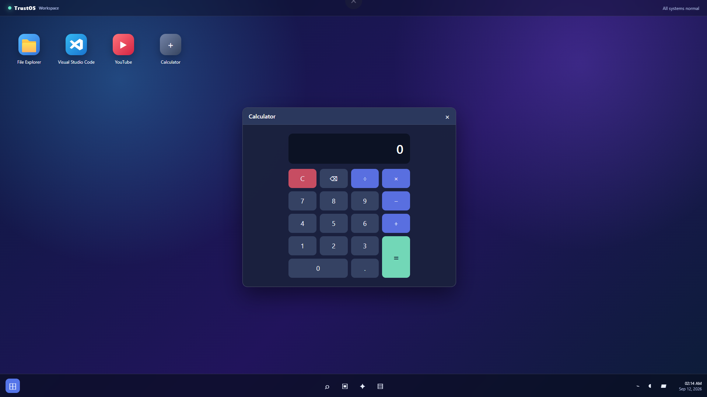
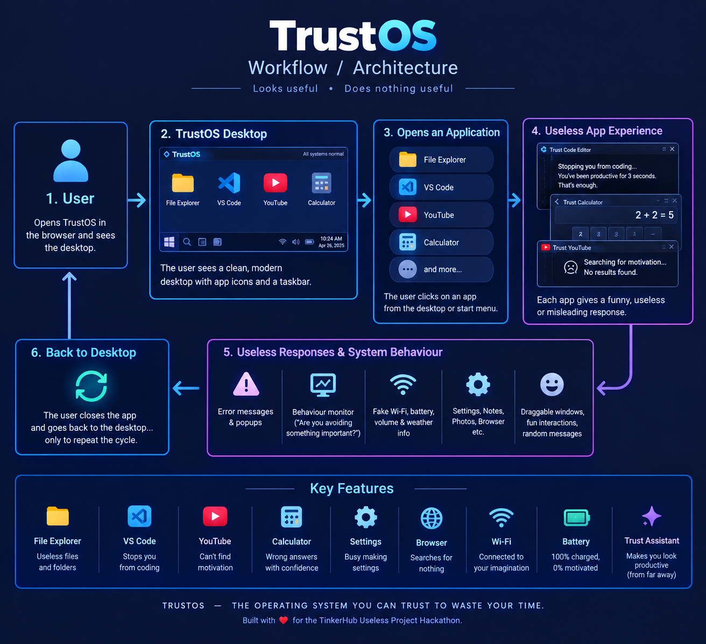

# Useless Desktop TrustOS 🎯

## Basic Details
### Team Name: pnr boys

### Team Members
- Team Lead: Harinand Babu - MES Collage Of Engineering And Technology,Kunnukara,Ernakulam
- Member 2: Abhishek P V - MES Collage Of Engineering And Technology,Kunnukara,Ernakulam

### Project Description
TrustOS is a completely useless desktop operating system designed to make you less productive. It has a fake File Explorer, a Calculator that gives wrong answers, a Code Editor that stops you from coding, and many other useless features.

### The Problem (that doesn't exist)
People are becoming too productive.

They need a system that helps them waste time, avoid coding, get wrong answers, and feel productive without actually doing anything.

### The Solution (that nobody asked for)
Introducing TrustOS — the operating system you can trust to waste your time.

📁 File Explorer — Contains files like Things I Will Read Later and productivity_avoidance_plan.pdf.

💻 VS Code — Tries to stop you from coding after a few seconds.

🧮 Calculator — Gives you a confidently wrong answer.

▶️ YouTube — Searches for motivation but can't find any.

🔋 Battery — 100% charged, 0% motivated.

📶 Wi-Fi — Connected to your imagination.

⚙️ Settings — Busy making settings.

🧠 Trust Assistant — Makes you look productive from far away.

## Technical Details
### Technologies Used

HTML

CSS

JavaScript

No frameworks

No backend

No database

100% uselessness

### Implementation

TrustOS is implemented as a web-based fake desktop operating system using HTML, CSS and JavaScript.

- **HTML** is used to create the desktop, taskbar, start menu, windows and application structure.
- **CSS** is used to design the Windows-like interface, icons, animations and overall appearance.
- **JavaScript** is used to make the applications interactive and add the useless features.

The main features implemented are:

- Fake File Explorer with useless files and folders.
- Calculator that intentionally gives wrong answers.
- Code Editor that stops the user from coding.
- Fake YouTube app that fails to find motivation.
- Fake Settings, Browser, Notes and Photos apps.
- Behaviour Monitor that detects when the user opens too many apps.
- Fake Wi-Fi, battery, volume and weather information.
- Draggable application windows and taskbar interactions.

The project runs completely in the browser and does not require a backend, database or external server.

# Run

Clone the repository.

Open index.html in browser.

Enjoy doing absolutely nothing useful.

### Project Documentation

# Screenshots 

**TrustOS Desktop:** The main TrustOS desktop showing the File Explorer, Visual Studio Code, YouTube, and Calculator applications.

**TrustOS Applications:** Shows multiple applications running at the same time. The File Explorer displays useless folders, while YouTube gives the funny message **"Error: Motivation not found."**

**Trust Calculator:** A fully functional-looking calculator with a useless twist. It is designed to give intentionally incorrect answers, making a normal calculator completely unreliable.
# Workflow

### Workflow Description

The TrustOS workflow starts when the user opens TrustOS in a web browser. The user enters the fake desktop and selects an application such as File Explorer, Calculator, VS Code or YouTube. Each application gives a useless, funny or unexpected response instead of doing its normal job. The user can close the application and return to the desktop, creating a cycle of useless interactions. The workflow shows how TrustOS is designed to look like a normal operating system while making the user less productive.

### Project Demo
# Video
[Add your demo video link here]
*Explain what the video demonstrates*

## Team Contributions

Designed and developed the TrustOS interface

Created the fake desktop applications

Added the useless interactions and funny system messages

Tested the system to make sure it remained completely useless

---
Made with ❤️ at TinkerHub Useless Projects 

